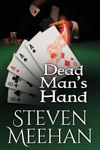

    

Marcus is a smooth talking lover of life, who excels at whatever he touches, especially Texas Hold’em. Armed with only his wits, powers of observation, and the proverbial ace up his sleeve, he is always on the lookout for the most exclusive games. So when he manages to come across a high-end tournament that is being hosted in New Orleans, he is immediately drawn to it.

On his way to the tournament Marcus unearths the identity of the man who is orchestrating the tournament. And despite the involvement of Bertrand Dempsey, one of the most influential criminal masterminds east of the Mississippi, Marcus heedlessly enters the tournament, only to discover too late that he got more than he ever bargained for.

Now Marcus must rely on more than his wits or smooth talk if he is going to stay one step ahead of the tournament’s organizer. He will have to rely upon the unique skills that mark him as special in order to leave the tournament with his money and his life.

<a href="/writing/forgers/dead-mans-hand/dmh-prologue">Read Sample</a>

    <a href="https://www.amazon.com/gp/product/1520247427/ref=as_li_tl?ie=UTF8&camp=1789&creative=9325&creativeASIN=1520247427&linkCode=as2&tag=mysite009e-20&linkId=18504421d9a9d640ffdaaaedda9d249c" class="purchase-links">Click here to buy the Paperback.</a>  
    <a href="https://www.amazon.com/gp/product/B00TTXVQ7A/ref=as_li_tl?ie=UTF8&camp=1789&creative=9325&creativeASIN=B00TTXVQ7A&linkCode=as2&tag=mysite009e-20&linkId=1b43884b8051fc20e5f8e6c9e6ca304a" class="purchase-links">Click here to buy the E-Book.</a>

 