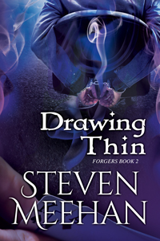

Francis managed to survive his brief employment with Bertrand Dempsey by the skin of his teeth.  The man whom Bertrand had commanded Francis to kill was like him, with one major exception, Alexis Rene LeBlanc knew all the ins and outs of their gift.  The pair, with some daring, had managed to engineer Francis’ freedom.

Now that Francis is free from Dempsey’s influence, he has gained a new master and teacher in Alexis.  Their relationship is tenuous at best, but if Francis gives up his criminal ways, Alexis will teach Francis all that he needs to know in order to use his gift and survive.

After reaching this arrangement, Francis’ former partner in crime and lifelong friend Matthew Williamson is in trouble.  He has been kidnapped by a shadowy organization that is threatening to kill him if Francis doesn’t surrender himself.  When Francis asks Alexis for help, his new mentor is not inclined to risk such a raw talent in an attempt to rescue a regular man.

But Francis will not allow his friend to suffer because of him.  Now Francis will have to convince his new mentor to help him free his friend from a highly funded group with no qualms about killing whoever they need to accomplish their goals.

<a href="https://www.wattpad.com/761379113-drawing-thin-prologue">Read Sample</a>

<a href="https://www.amazon.com/Drawing-Thin-Forgers-Steven-Meehan/dp/1086229924/ref=tmm_pap_swatch_0?_encoding=UTF8&qid=1567163108&sr=8-1" class="purchase-links">Click here to buy the Paperback.</a>  
<a href="https://www.amazon.com/Drawing-Thin-Forgers-Book-2-ebook/dp/B07X2Z5KZ1/ref=sr_1_1?keywords=steven+meehan+drawing+thin&qid=1567163108&s=gateway&sr=8-1" class="purchase-links">Click here to buy the E-Book.</a>

