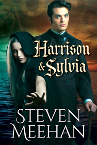

    

Harrison is the eldest son of a powerful nobleman of the isles, who would rather tinker than learn how to run the family business.  With tireless effort he manages to prove that his tinkering is of value not only to his father but to the king of the isles.  He is rapidly able to befriend the king making a powerful ally in his desire to explore how things work.

While Sylvia is a shifter who works diligently keeping the King of the Southern Kingdom alive.  She is an extremely skilled woman who is able to travel where most others cannot and finding information when others cannot.  Since she can alter her form she always has weapons close at hand which helps her honor her contracts.  Her current contract is her most difficult since the king of the Southern Kingdom decides to flaunt his wealth to citizens who have been beaten down by his harsh rule.

Each has had their own personal struggles and of course they have had their personal triumphs.  Yet Sylvia is forced to enter the rift, which is a portal that permanently sends someone to a world other than their own.  Once Sylvia arrives on that other world one of the first people she sees is Harrison along with a handful of armed guards.  Though their meeting is far from amicable, they are thrust together trying to learn from each other.

