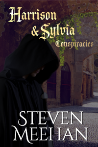

Now a member of the King's court, Harrison continues tinkering with relics for Jacob. While researching some relics, Harrison turns his attention to the Isle's current events. In so doing, he helps the local constabulary with their troubles. He even delves into other mysteries for them. 

Stranded in this strange new world, Sylvia strives to discover a way to survive. Falling upon her past experiences, Sylvia reaches out to the city's urchins. As she gathers these children unto herself, Sylvia transforms them into an army of eyes and ears. Sylvia uses that new army to establish herself in the underbelly of the city.

With her reputation established, two mysterious strangers approach Sylvia. They begin to hire her to help them change the Isles forever. The jobs start small, but the strangers escalate the work they need from Sylvia.  Now that on opposite sides, Sylvia and Harrison are set on a collision course. What will happen when they reunite? And what of these two new strangers? Will their plans spell out disaster for the Isles and Jacob's court? Or will Harrison prevent these strangers from changing the isles?

